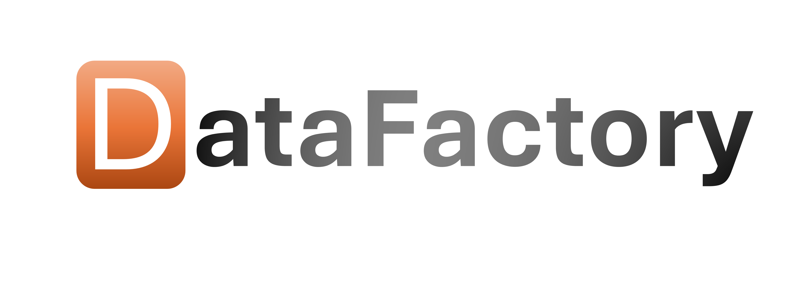
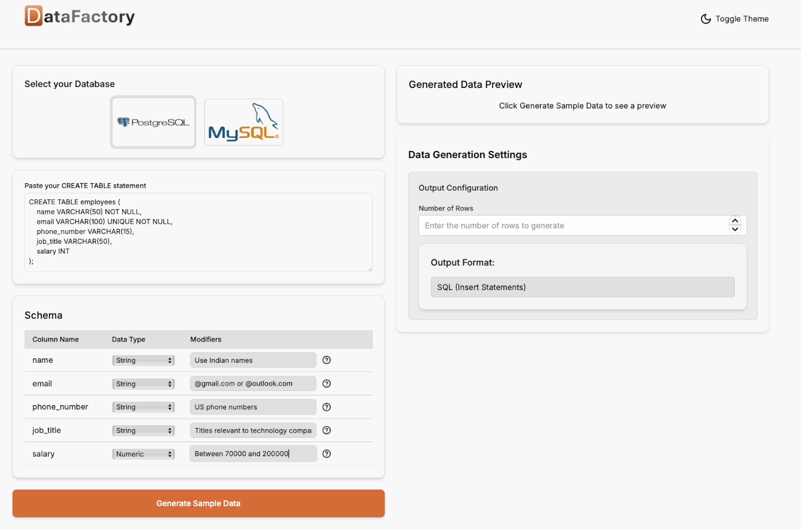
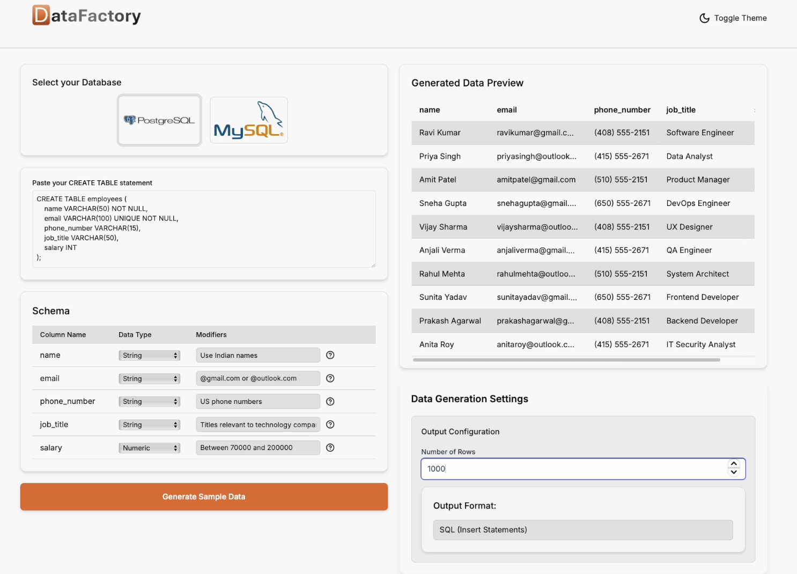

# DataFactory

DataFactory is a modern web application designed to help developers effortlessly generate realistic test data based on database schemas. With an intuitive interface and support for multiple databases, DataFactory streamlines the process of creating sample datasets that match your database structure, ensuring accurate and meaningful testing.



## Key Features

### Database Support
- **PostgreSQL**
- **MySQL**

### Smart Schema Parsing
- Automatically parses `CREATE TABLE` statements for seamless schema integration.
- Visual schema editor for customization and refinement.
- Type inference with validation for accurate data modeling.

### Flexible Data Generation
- Generate datasets with customizable row counts.
- Export in multiple formats: **SQL**, **JSON**, **CSV**.
- Real-time preview of generated data with progress tracking for large datasets.

### Modern UI/UX
- Responsive design for desktop and mobile.
- Light and Dark themes for comfortable use.
- Real-time feedback for instant insights.
- Smooth animations for a modern experience.

---

## Tech Stack

### Frontend
- **Next.js 14** (App Router)
- **TypeScript**
- **React**
- **Shadcn UI**
- **Radix UI**
- **Tailwind CSS**

### Backend
- **OpenAI API**
- **Python FastAPI**
- **Faker** (data generation)

---

## Getting Started

### Prerequisites
Ensure the following are installed on your system:
- **Node.js 18+**
- **Python 3.8+**
- **npm** or **yarn**

### Installation

1. **Clone the repository**:
   ```bash
   git clone https://github.com/yourusername/syn-data-generator.git
   cd syn-data-generator
   ```

2. **Install frontend dependencies**:
   ```bash
   npm install
   ```
   Or, if you prefer yarn:
   ```bash
   yarn install
   ```

3. **Install backend dependencies**:
   ```bash
   cd backend
   pip install -r requirements.txt
   ```

4. **Start the development servers**:
   ```bash
   npm run dev
   python run.py
   ```

5. **Access the application**:
   Visit [http://localhost:3000](http://localhost:3000) to start using DataFactory.

---

## Usage

1. **Select your target database type** (PostgreSQL or MySQL).
2. **Paste your `CREATE TABLE` statement** to parse your schema.
3. **Customize the schema** in the visual editor, if needed.
4. **Generate a preview** of your data.
5. **Set output preferences**, such as row count and file format.
6. **Download your test data** in SQL, JSON, or CSV format.

---

## License

This project is licensed under the MIT License.

---

## Screenshots


*Example of schema parsing with visual editor.*


*Real-time preview of generated data.*

---

## Acknowledgments

A huge thanks to these amazing projects that power DataFactory:
- [Faker](https://faker.readthedocs.io/) for realistic data generation.
- [Shadcn UI](https://ui.shadcn.com/) for elegant and reusable components.
- [Lucide Icons](https://lucide.dev/) for a sleek icon set.
